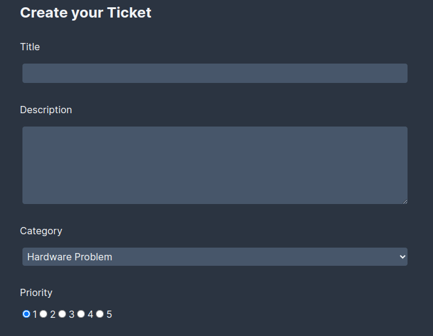
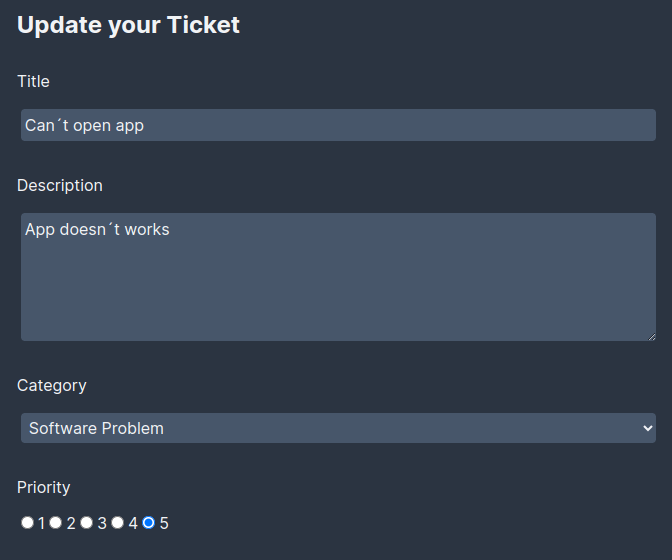
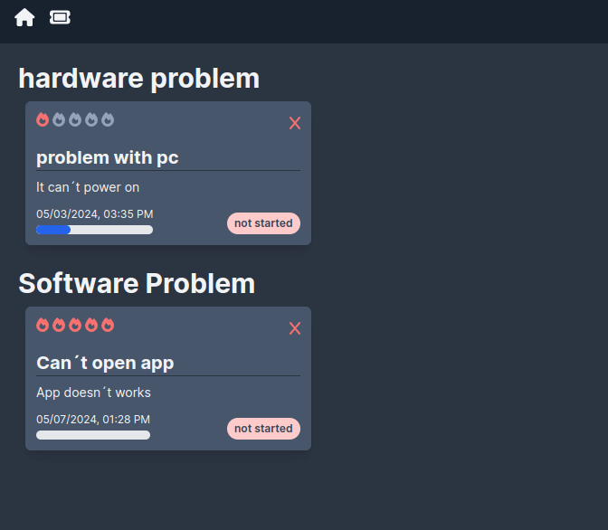
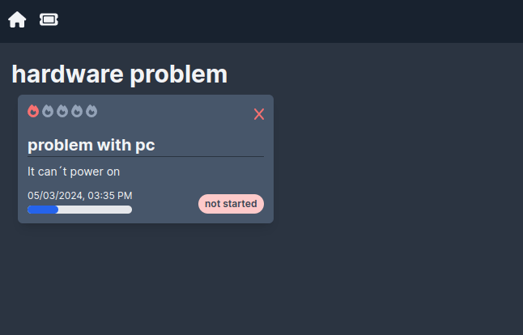

# Ticketing with Nextjs, MongoDB and Docker
Simple web page made with Nextjs and MongoDB for reporting computational problems through tickets. Finally, Docker is used for containerization.

## Features
- **Create ticket**
  <p align="start">
    
  </p>
- **Edit ticket**
  <p align="start">
    
  </p>
- **Show tickets**
  <p align="start">
    
  </p>
- **Delete ticket**
  <p align="start">
    
  </p>

## Getting Started
# Run Nextjs with MongoDB locally

To set up the Next.js app on your local machine:
1. Go to the project directory and install the required dependencies:
```bash
npm install
```

2. Create a `.env.local` file in the root directory and provide the next environment variable:
```
MONGODB_URI=mongodb://your-mongodb-uri
```

3. Run the Next.js development server:
```bash
npm run dev
```
4. Make sure you have a running MongoDB instance and obtain the connection URI.

# Run Nextjs with MongoDB using docker
To deploy the application using Docker:
1. Run the Docker image using the provided Docker compose:

```bash
docker compose-up -d
```
